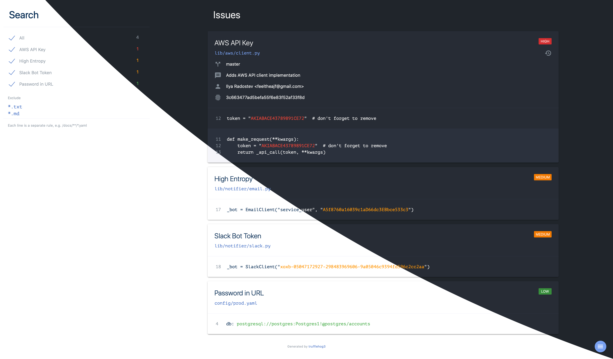
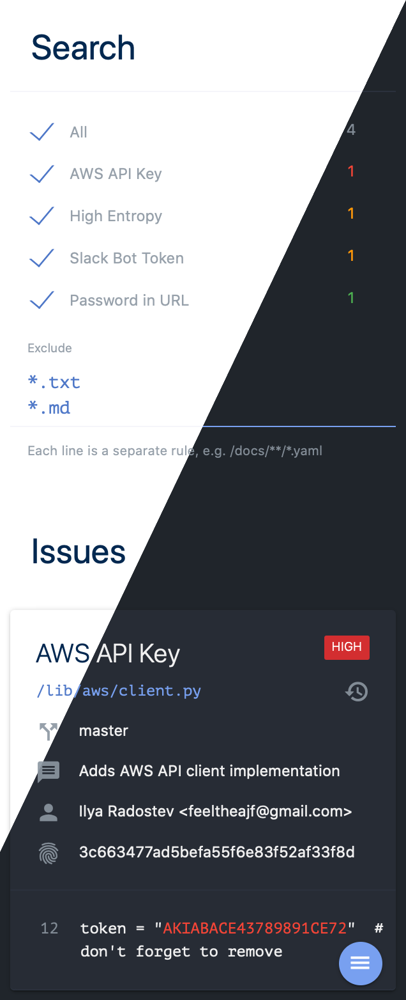

[](https://pypi.org/project/trufflehog3)

[](https://pepy.tech/project/trufflehog3)
[](https://travis-ci.com/feeltheajf/trufflehog3)
[](https://codecov.io/gh/feeltheajf/trufflehog3)

# trufflehog3

This is an enhanced version of the [truffleHog](https://github.com/dxa4481/truffleHog) scanner

<p align="middle">
  <a href="https://feeltheajf.github.io/trufflehog3/examples/report">
    
    
  </a>
</p>

## Usage

Full API documentation is available at [feeltheajf.github.io/trufflehog3](https://feeltheajf.github.io/trufflehog3/).

You can always check available options by running

```
trufflehog3 --help
```

Here are some basic examples to get you started

```bash
# clone remote Git repository, scan 10 latest commits and output to stdout
$ trufflehog3 --max-depth 10 https://github.com/feeltheajf/trufflehog3

# disable Git history search, scan current directory and save report as JSON
$ trufflehog3 --no-history --format json --output report.json

# render HTML report from JSON
$ trufflehog3 -R report.json --output report.html
```

## New

v3 was heavily updated both under the hood and from API perspective. See below for more details on new features.

### Automatic Config Detection

`.trufflehog3.yml` is automatically detected in the root of the scanned directory. However, you can still specify custom path using `-c/--config` CLI argument. Do not forget to check out the updated [.trufflehog3.yml](.trufflehog3.yml) config file format.

### HTML Reports

HTML reports are now much prettier and more useful than ever. You can filter out specific rules or paths on the fly without fiddling with raw data. Have a look at a sample [HTML report](https://feeltheajf.github.io/trufflehog3/examples/report) and try it on your own.

### Inline Exclude

Inline `nosecret` comments are now supported for excluding false positives

```python
# skip all rules
password = ""  # nosecret

# only skip rule with specific id
password = ""  # nosecret: generic.password
```

If for some reason you would like to avoid such behavior, there is a new `--ignore-nosecret` CLI flag which will tell trufflehog3 to ignore all inline comments.

### Incremental Scan

You can now run an incremental scan by specifying the path to the baseline JSON report as `-i/--incremental` CLI argument. In this case, only the new issues compared to the baseline will be reported.

## Thanks

Special thanks to Dylan Ayrey ([@dxa4481](https://github.com/dxa4481)), developer of the original [truffleHog](https://github.com/dxa4481/truffleHog) scanner
